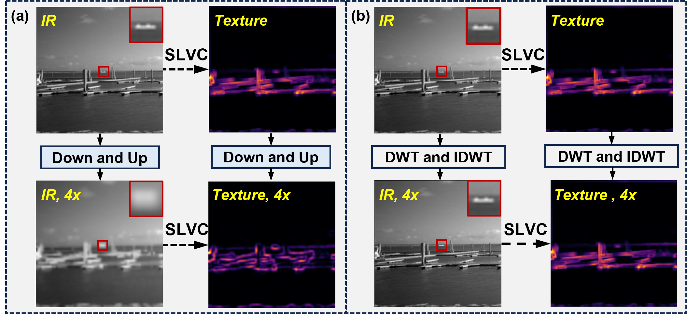
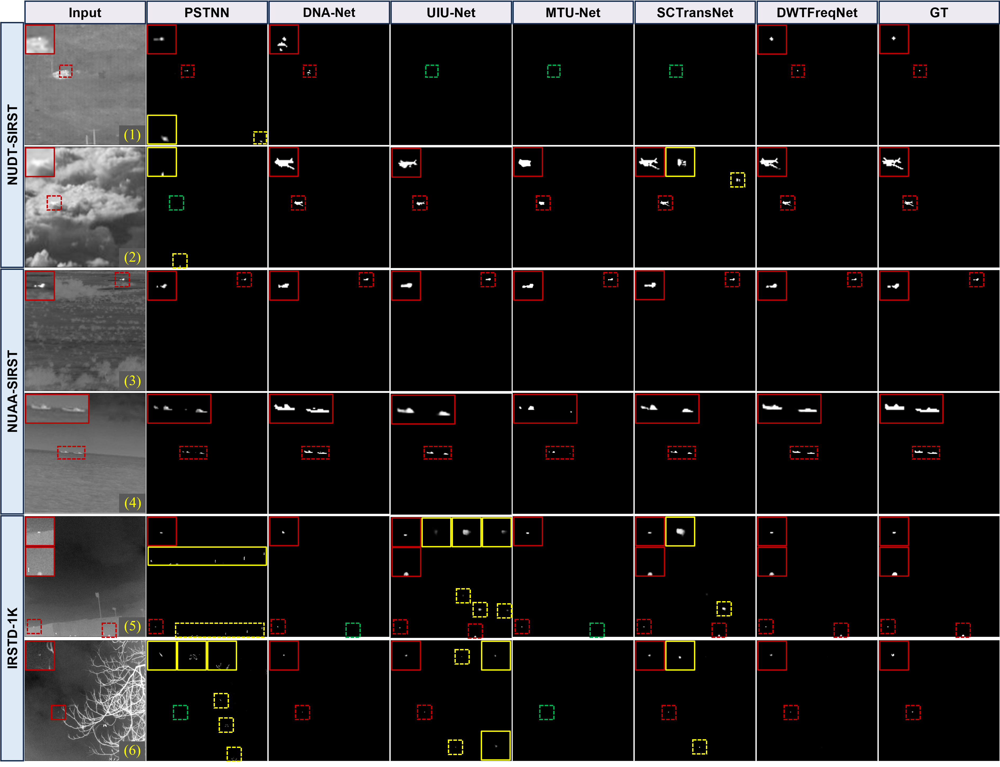
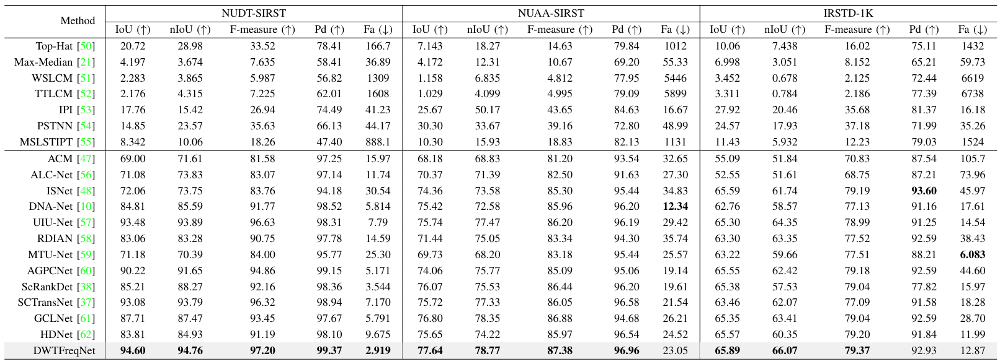

## Experiment A v2: isolated WULLE local branch

`model/DWTFreqNet_WULLE.py` adds the Wavelet U-Net Local-frequency Learning
Encoder/decoder branch without changing `model/DWTFreqNet.py`. Select it with
`train_one.py --model-variant dwtfreqnet_wulle_a`; use
`dwtfreqnet_original` for the baseline. The protocol, commands and live experiment
table are recorded in `EXPERIMENT_A_WULLE_V2_RECORD.md`.

## Experiment B: single decoder directional pyramid

`model/DWTFreqNet_SingleDecoder.py` isolates a four-DWT/four-IDWT architecture
with one wavelet decoder. Its `sd_raw`, `sd_awgm`, `sd_pyramid`, and `sd_full`
variants are trained through `train_experiment_b.py`; protocol and live results
are recorded in `EXPERIMENT_B_SINGLE_DECODER_RECORD.md`.

## Experiment E: LFSS-preconditioned AWGM encoder

`model/DWTFreqNet_SingleDecoder_LFSS_AWGM.py` adds one original Wave-Mamba
LFSSBlock before each stage-wise AWGM while preserving raw H/V/D coefficients
and the single wavelet decoder. E1 retains the original post-AWGM Res_block;
E2 replaces it with a fixed Conv1x1-BN-GELU transition. The Chinese protocol,
validation, complexity, queue and live results are recorded in
`EXPERIMENT_E_LFSS_AWGM_RECORD.md`.

## Experiment H: E1 decoder LFP purification

`model/DWTFreqNet_SingleDecoder_LFSS_AWGM_DecoderLFP.py` keeps the E1 encoder
and decoder body fixed and purifies aligned raw H/V/D immediately before all
four decoder IDWT stages. Six formal variants compare raw-LL versus decoder-low
attention sources and attention-only, fixed-Gaussian, or adaptive-Gaussian
purification. The Chinese design, validation, complexity and live 18-task queue
are recorded in `EXPERIMENT_H_DECODER_LFP_RECORD.md`.

<div align="center">
  
<h1><span style="font-size:2em;">🔴</span> Infrared Small Target Detection via Wavelet-Driven Frequency Matching and Saliency-Difference Optimization</h1>
</div>

> #### Qianwen Ma, Shangwei Deng, Bincheng Li, Zhen Zhu, Ziying Song, Xiaobo Li<sup>&dagger;</sup>, and Haofeng Hu<sup>&dagger;</sup>
> <sup>&dagger;</sup>Correspondence

> Tianjin University, Beijing Jiaotong University

<div align="center">

<p align="center" style="font-style: italic;">
(a) Conventional downsampling and upsampling processes. SLVC is sliding local variance calculation, $4 \times$ is images with 4-fold downsampling followed by restoration to original size, where the processed texture images show differences and roughness compared to the pre-processed images. (b) Wavelet transform downsampling and upsampling processes, where the two texture images before and after processing exhibit extreme similarity.
</p>
  
---
</div>

<div align="center">

<p align="center" style="font-style: italic;">
(a) The overall framework of the proposed method. (b) The process of generating four low-resolution components from the input image through DWT downsampling and the process of upsampling back to a high-resolution image through IDWT. (c) The processing of two consecutive WFE modules. When the module is a DWFE, the feature maps will be concatenated with those from other nodes.
</p>

</div>

---

## :fire: News
* **[2025.09]** Current Status: TGRS Accept!
* **[2025.08]** Current Status: TGRS R2!
* **[2025.08]** We release the code.  

---

## 💻 Requirements

- PyTorch >= 1.13.1  
- CUDA >= 11.3

---

# 🚀 Train and Inference Guide for DWTFreqNet

This section outlines the steps to run inference using the DWTFreqNet model.

---

### 📝 Step 1: Prepare the Dataset

Download the open-source infrared small target detection datasets we used:
[NUDT-SIRST](https://github.com/YeRen123455/Infrared-Small-Target-Detection), [NUAA-SIRST](https://github.com/YimianDai/open-deepinfrared), and [IRSTD-1K](https://github.com/RuiZhang97/ISNet).

Specify the dataset you want to train on and the path where the dataset is placed:
```python
parser.add_argument("--dataset_names", default=['NUDT-SIRST'], type=list)
parser.add_argument("--dataset_dir", default=r'../Dataset')
```

---

### ▶️ Step 2: Run Train

Run the train script:

```bash
python train.py
```

The output results will be saved to the `./log/` directory.

---

### DM-AWGM variants

`DWTFreqNet` keeps the original AWGM as the default and also supports:

- `dm_awgm_full`: horizontal/vertical bidirectional Mamba plus diagonal deformable convolution
- `dm_awgm_no_mamba`: convolutional H/V branches plus diagonal deformable convolution
- `dm_awgm_no_dcn`: horizontal/vertical bidirectional Mamba plus a convolutional D branch
- `dm_awgm_conv_only`: convolutional branches for all three directions

Wavelet-Aligned Eight-Directional Mamba (W8M-AWGM) adds horizontal LR/RL,
vertical TB/BT, and diagonal NWSE/SENW/NESW/SWNE scan routes while retaining
the original `A * attention + A` guidance interface:

- `w8m_diag2_subband_shared`: two diagonal routes, H/V/D subband sharing
- `w8m_diag4_independent`: eight independent Mamba instances
- `w8m_diag4_pair_shared`: one Mamba for each forward/reverse geometric pair
- `w8m_diag4_subband_shared`: H, V, and D each use one shared Mamba
- `w8m_diag4_axial_diag_shared`: one axial and one diagonal Mamba
- `w8m_diag4_axial_diag_shared_dir_embed`: two shared Mambas plus route embeddings
- `w8m_diag4_all_shared`: all eight routes share one Mamba

W8M diagonal routes use cached, invertible `snake` permutations by default.
The original AWGM remains the default, so existing checkpoint inference is
unchanged unless a W8M variant is explicitly selected.

Install the additional dependencies from `requirements-dm-awgm.txt`. Formal
Mamba experiments require a working `mamba_ssm.Mamba` CUDA backend, and formal
DCN experiments require `torchvision.ops.DeformConv2d`. Fallback backends are
provided only for smoke testing and are disabled by default.

Example:

```bash
python train_one.py \
  --dataset-name NUDT-SIRST \
  --dataset-dir /path/to/datasets \
  --output-dir runs/dm_awgm_full \
  --awgm-variant dm_awgm_full
```

Run a forward/backward, shape, finite-value, parameter, FLOPs, and speed check:

```bash
python tools/smoke_test_dm_awgm.py --awgm_variant dm_awgm_full
```

Run the exact 3x3 diagonal-order, completeness, inverse-permutation, parameter
sharing, route-difference, and shared-gradient tests:

```bash
python tools/test_w8m_diagonal.py
```

Verify the physical direction represented by the repository's returned H/V
Haar bands using synthetic horizontal and vertical lines/edges:

```bash
python tools/check_haar_direction_mapping.py
python tools/check_haar_direction_mapping.py --require-aligned-routing
```

For the current filters, returned `H=LH` responds to vertical structure and
returned `V=HL` responds to horizontal structure. W8M therefore routes H to
the TB/BT vertical scans and V to the LR/RL horizontal scans. The strict
command exits non-zero if a later filter or routing change breaks this match.

Run a W8M smoke test with checkpoint round-trip, FLOPs, latency, FPS, and peak
GPU-memory reporting:

```bash
python tools/smoke_test_dm_awgm.py \
  --awgm_variant w8m_diag4_subband_shared \
  --batch-size 1
```

The Stage 1 launcher uses epoch 400 as a midpoint checkpoint while keeping the
cosine scheduler configured for 1000 epochs. The current three-dataset schedule
keeps all six selected runs and automatically resumes each one from epoch 400
to epoch 1000 without changing the LR schedule:

```bash
PROJECT=/path/to/DWTFreqNet \
PYTHON_BIN=/path/to/python \
DATASET_DIR=/path/to/datasets \
bash scripts/launch_w8m_stage1.sh 0 1 2
```

To place the same Stage 1 variant on a specific dataset/GPU:

```bash
bash scripts/run_w8m_stage1_dataset.sh \
  NUAA-SIRST w8m_diag4_subband_shared 0 1000
```

The server-side baseline, full, ablation, and pretrained-weight evaluation
results are summarized in [EXPERIMENT_RECORD.md](EXPERIMENT_RECORD.md).

---

### ▶️ Step 3: Run Test

Run the test script:

```bash
python test.py
```

Weights

Baidu Pan: https://pan.baidu.com/s/1nWugwqxK-KvL99A_F7_EKA?pwd=rph9 code: rph9

---

## 📊 Experimental Results

<div align="center">

</p>


</div>

---

## 🙏 Thanks
Our code is based on [SCT](https://github.com/xdFai/SCTransNet). You can refer to their README files and source code for more implementation details.

---

## 📖 Citation

If you find our work useful, please consider citing:

```
@article{ma2025dwtfreqnet,
  title={DWTFreqNet: Infrared Small Target Detection via Wavelet-Driven Frequency Matching and Saliency-Difference Optimization},
  author={Ma, Qianwen and Deng, Shangwei and Li, Bincheng and Zhu, Zhen and Song, Ziying and Li, Xiaobo and Hu, Haofeng},
  journal={IEEE Transactions on Geoscience and Remote Sensing},
  year={2025},
  publisher={IEEE}
}
```
